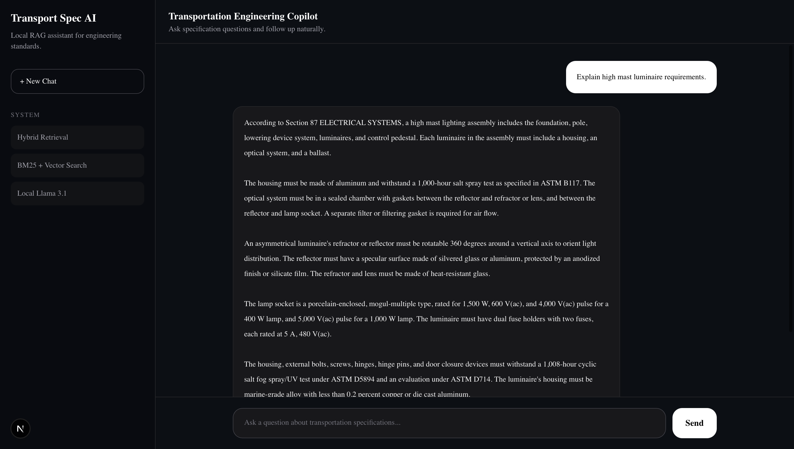
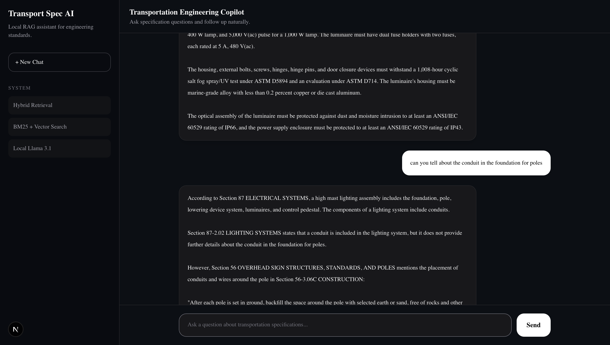

# Transport Spec RAG AI

An AI-powered engineering assistant that enables conversational search over transportation and engineering specification documents using a Retrieval-Augmented Generation (RAG) architecture.

Built with **Python**, **FastAPI**, **Next.js**, **Qdrant**, **Ollama**, and **Llama 3.1**, the application provides grounded, context-aware answers with source citations while supporting multi-turn conversations.

**Repository:** [github.com/Manmeet26/transport-spec-rag-ai](https://github.com/Manmeet26/transport-spec-rag-ai)

---

## Screenshots

### Home


### Conversation



### Follow-up Questions



---

## Features

- Conversational AI assistant for transportation engineering specifications
- Retrieval-Augmented Generation (RAG)
- Hybrid retrieval: BM25 keyword search + semantic vector search
- Reciprocal Rank Fusion (RRF) and cross-encoder reranking
- Conversational memory for follow-up questions
- Section-aware document chunking
- Metadata-aware source citations in API and UI
- Fully local LLM using Ollama
- Modern web interface built with Next.js
- FastAPI backend with Docker Compose support

---

## Tech Stack

**Frontend:** Next.js, React, TypeScript, Tailwind CSS

**Backend:** FastAPI, Python

**AI / ML:** Ollama, Llama 3.1, Sentence Transformers, BAAI/bge-large-en-v1.5, BAAI/bge-reranker-large

**Retrieval:** BM25, Qdrant, hybrid search, RRF

**Document Processing:** PyMuPDF

---

## Project Structure

```
transport-spec-rag-ai/
├── app/
│   ├── api.py
│   ├── ingest.py
│   ├── query.py
│   ├── rag_utils.py
│   └── ...
├── transport-rag-ui/
├── tests/
├── data/
├── docker-compose.yml
└── README.md
```

---

## Quick Start (Local)

### 1. Install dependencies

```bash
python -m venv venv
source venv/bin/activate
pip install -r requirements.txt
```

Copy environment defaults:

```bash
cp .env.example .env
```

### 2. Start Ollama and pull the model

```bash
ollama serve
ollama pull llama3.1:8b
```

### 3. Run the backend

```bash
cd app
uvicorn api:app --reload
```

### 4. Run the frontend

```bash
cd transport-rag-ui
npm install
npm run dev
```

Open [http://localhost:3000](http://localhost:3000)

---

## Docker Compose

```bash
docker compose up --build
```

After Ollama starts, pull the model inside the container:

```bash
docker compose exec ollama ollama pull llama3.1:8b
```

Services:

- Frontend: [http://localhost:3000](http://localhost:3000)
- Backend: [http://localhost:8000](http://localhost:8000)
- Ollama: [http://localhost:11434](http://localhost:11434)

---

## Ingest Documents

Place the PDF at `data/specs.pdf`, then run:

```bash
cd app
python ingest.py
```

This writes `data/chunks.json`, `data/bm25.pkl`, and Qdrant vectors under `qdrant_storage/`.

---

## API

### `GET /`

Health check.

### `POST /query`

Request:

```json
{
  "question": "What are the curing requirements for concrete?"
}
```

Response:

```json
{
  "answer": "...",
  "rewritten_query": "...",
  "citations": [
    {
      "section": "90-1.02C",
      "title": "Concrete Requirements",
      "page": 12,
      "snippet": "..."
    }
  ]
}
```

---

## Tests

```bash
pytest tests -q
```

---

## Example Questions

- What are the curing requirements for concrete?
- Explain pull box installation requirements.
- What are the requirements for high mast luminaires?
- What are the cold weather curing requirements?
- Summarize Section 87.

---

## License

MIT — see [LICENSE](LICENSE).
